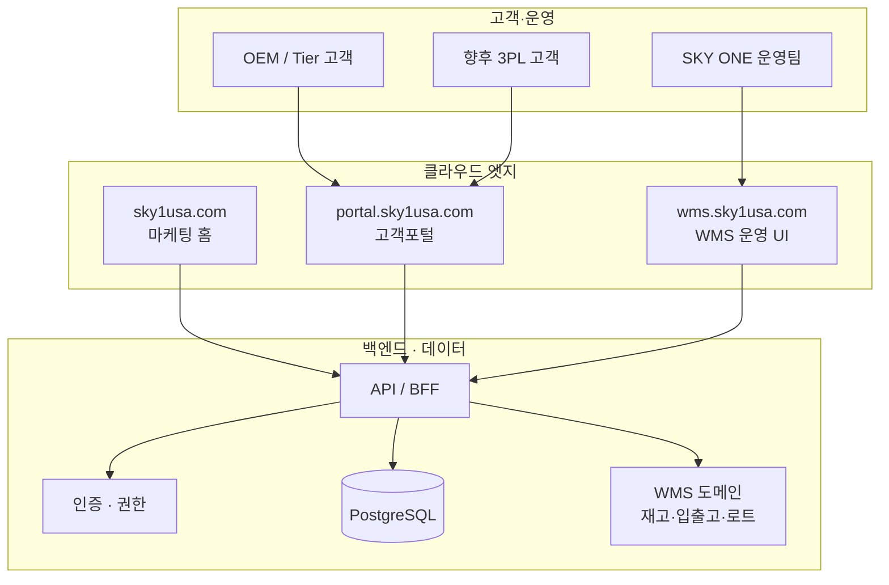

# SKY ONE SOLUTION — 플랫폼 전략 로드맵

**핵심 전략:** 홈페이지 + 고객포털 + WMS 통합 플랫폼  
**원칙:** 초기 클라우드 기반 빠른 구축 → 성장에 따라 기능 확장 → 고객 재고 조회 → 3PL/물류 고객 확대 가능 구조

현재 저장소(`blog-starter-kit`)는 **1단계: 마케팅 홈페이지(sky1usa.com)** 입니다. 아래는 이후 단계별로 **수정·준비할 항목**을 정리한 문서입니다.

---

## 1. 목표 아키텍처 (최종 그림)



| 영역 | 역할 | 우선순위 |
|------|------|----------|
| **홈페이지** | 브랜딩, 사업 소개, 문의 | ✅ 현재 운영 중 |
| **고객포털** | 로그인, 재고·입출고 현황, ASN/출하 조회, 문서 | 🔜 1차 확장 |
| **WMS** | 창고 운영, 피킹/패킹, 로케이션, 바코드·라벨 | 🔜 2차 (또는 포털과 동시 MVP) |

---

## 2. 단계별 계획

### Phase 0 — 현재 (완료·유지)

- Next.js 단일 앱, Vercel, `main` → sky1usa.com
- 한·영 마케팅 콘텐츠 (`src/lib/i18n/translations.ts`)
- Network 지도·OEM 거리 표 등 정적 정보

**유지:** 브랜딩·문구·이미지는 홈페이지 전용으로 두고, **재고/주문 데이터는 포털로만** 노출 (보안·역할 분리).

---

### Phase 1 — 고객포털 MVP (클라우드, 빠른 구축)

**목표:** 고객이 직접 **재고 수량·입고/출고 이력·출하 예정**을 조회.

| 준비 항목 | 권장 방향 | 비고 |
|-----------|-----------|------|
| 호스팅 | Vercel 동일 팀 또는 **서브도메인** `portal.sky1usa.com` | 초기엔 같은 repo의 `/portal` 라우트 그룹도 가능 |
| 인증 | Clerk / Auth0 / NextAuth + 이메일 초대 | 고객사별 계정, MFA는 성장 후 |
| DB | **Supabase** 또는 **Neon (Postgres)** | Vercel과 연동 쉬움 |
| API | Next.js Route Handlers (`app/api/`) 또는 별도 Nest/Fastify | 초기엔 모노레포 내 API 권장 |
| 멀티테넌트 | `tenant_id` = 고객사(OEM/3PL) ID | 처음부터 컬럼·RLS 설계 |
| UI | 홈과 동일 Tailwind·브랜드 (`src/lib/brand.ts` 재사용) | 포털 전용 레이아웃 분리 |

**포털 MVP 화면 (최소):**

1. 로그인 / 비밀번호 재설정  
2. 대시보드 — SKU별 가용재고, 로트/로케이션(필요 시)  
3. 입고·출고 이력 (기간 필터)  
4. (선택) CSV 다운로드, 알림 구독  

---

### Phase 2 — WMS 운영 기능

**목표:** 창고 실무(스캔, 피킹, 적치, 사이클카운트) + 포털 데이터의 **단일 재고 원장(Single source of truth)**.

| 기능 블록 | 설명 |
|-----------|------|
| 마스터 | SKU, UOM, 고객사, 창고/존/로케이션 |
| 입고 | ASN, GRN, 검수·QC 연계(기존 사업과 연결) |
| 출고 | 오더, 피킹, 패킹, 출하 확정 |
| 재고 | 가용/할당/홀드, 로트·시리얼(필요 시) |
| 연동 | 홈/포털은 **읽기 위주**, WMS가 쓰기 담당 |

**구축 옵션:**

- **A. 자체 개발 (Next + Postgres)** — 3PL 확장·커스터마이즈에 유리, 개발 기간 김  
- **B. 클라우드 WMS SaaS + API 연동** — 속도 우선 시 (Fishbowl, Extensiv, 등) PoC 후 결정  
- **C. 하이브리드** — 핵심 입출고만 자체, 나머지 SaaS  

전략상 **“향후 3PL 확대”** 를 위해 **테넌트·창고·계약 단위 권한 모델**은 Phase 1 DB 설계에 포함 권장.

---

### Phase 3 — 3PL / 물류 고객 확대

| 요구 | 설계 대응 |
|------|-----------|
| 여러 화주(3PL 고객) | `tenant_id` + `shipper_id` (화주) 2단계 |
| 요금·리포트 | 테넌트별 청구 단위, 스토리지/핸들링 메트릭 |
| 화주 포털 | 동일 포털 앱, 로그인 시 shipper 스코프 |
| 온보딩 | 관리자가 테넌트·사용자·SKU 일괄 등록 |

---

## 3. 지금 이 저장소에서 미리 해두면 좋은 것

### ✅ 이미 갖춘 것 (활용)

- Next.js 15 + TypeScript + Tailwind  
- 한·영 i18n (`language-context`, `translations.ts`) → 포털에도 확장 가능  
- 브랜드·이미지 중앙 관리 (`brand.ts`, `images.ts`)  
- Vercel 배포 파이프라인 (`docs/업데이트-배포-가이드.md`)

### 🔧 단기 준비 (코드·구조)

| 항목 | 권장 조치 | 시기 |
|------|-----------|------|
| 환경 변수 | `.env.example` 참고, Vercel에 Preview/Production 분리 | 포털 착수 전 |
| 라우트 구조 | `app/(marketing)/`, `app/(portal)/`, `app/api/` 그룹으로 분리 | 포털 개발 시작 시 |
| 블로그 스타터 잔여 | `_posts/`, `src/app/posts/` — 미사용 시 제거해 복잡도 감소 | 여유 있을 때 |
| 문의 폼 | Contact를 이메일만이 아닌 DB/CRM 저장으로 확장 | Phase 1 |
| 타입·도메인 | `src/lib/domain/` 에 `Tenant`, `Inventory`, `Shipment` 타입 스켰만 정의 | API 설계 전 |

### ☁️ 인프라·계정 (비개발)

| 항목 | 메모 |
|------|------|
| DNS | `portal.`, `api.` 서브도메인 예약 |
| DB | Supabase/Neon 프로젝트 생성, 백업·리전(미국 동부 권장) |
| 인증 | Clerk/Auth0 테넌트, 고객 도메인 이메일 |
| 보안 | SOC2 전까지도 HTTPS, RLS, 감사 로그(누가 재고 조회) 설계 |
| WMS 하드웨어 | 바코드 스캐너, 라벨 프린터 — Phase 2 |

---

## 4. 수정이 필요해질 홈페이지 영역

홈페이지는 **마케팅**에 집중하고, 실시간 재고는 포털로 유도하는 것이 좋습니다.

| 섹션 | 향후 조정 |
|------|-----------|
| Business Area | 포털/WMS 연계 서비스(실시간 재고 조회, ASN) 문구 추가 |
| Innovation | “디지털 창고·고객 포털” 스토리 보강 |
| Contact | “포털 계정 문의” CTA, 로그인 링크 |
| Header/Footer | `Customer Login` → portal URL |
| Network | 정적 지도 유지 (물류 거점 설명용) |

문구만 바꿀 때는 `translations.ts` 만 수정하면 됩니다.

---

## 5. 기술 스택 제안 (클라우드·빠른 구축)

| 레이어 | 1차 추천 | 이유 |
|--------|----------|------|
| Frontend | Next.js (현재 repo 확장) | 홈·포털 UI 공유, Vercel 배포 |
| API | Next Route Handlers → 필요 시 분리 | 초기 단순 |
| DB | PostgreSQL (Supabase) | RLS로 멀티테넌트, 실시간 구독 옵션 |
| Auth | Clerk (B2B) 또는 Auth0 | 조직/초대 흐름 |
| 파일 | S3 / Vercel Blob | BOL, 검사 리포트 PDF |
| 작업 큐 | Inngest / Trigger.dev (Vercel 친화) | 입출고 알림, 배치 |
| 모니터링 | Vercel Analytics + Sentry | |

WMS 전용 모바일(스캔)은 Phase 2에서 PWA 또는 React Native 검토.

---

## 6. 데이터 모델 초안 (멀티테넌트·3PL 대비)

```
Tenant (SKY ONE 또는 3PL 사업 단위)
  └── Shipper (화주 / OEM 고객)
        └── User (portal login, role: viewer | admin)
        └── SKU
        └── Warehouse
              └── Location
              └── InventoryBalance (sku, location, qty, lot?)
        └── InboundOrder / Receipt
        └── OutboundOrder / Shipment
```

**Row Level Security:** `tenant_id` (및 `shipper_id`) 로 포털 사용자는 자사 데이터만 조회.

---

## 7. 리스크·결정이 필요한 사항

1. **자체 WMS vs SaaS** — 6개월 내 포털만 필요한지, 창고 스캔까지 필요한지  
2. **기존 ERP/고객 시스템** — EDI/API 연동 범위 (HMMA 등)  
3. **QC/리워크 모듈** — WMS 이벤트로 넣을지 별도 모듈로 둘지  
4. **규정·데이터 거주** — 미국 내 데이터만 유지할지  

---

## 8. 다음 액션 체크리스트

- [ ] Phase 1 착수일·포털 MVP 화면 목록 확정  
- [ ] 인증·DB 벤더 선택 (Clerk + Supabase 등)  
- [ ] `portal.sky1usa.com` DNS 및 Vercel 프로젝트/경로 결정  
- [ ] 멀티테넌트 ERD 1차 리뷰  
- [ ] 홈페이지 Header에 Customer Login 링크 (URL 확정 후)  
- [ ] 미사용 블로그 라우트 정리 여부 결정  

---

## 관련 문서

- [업데이트·배포 가이드](./업데이트-배포-가이드.md) — sky1usa.com 현재 배포  
- [.env.example](../.env.example) — 향후 API/DB/Auth 환경 변수 템플릿  

*문서 버전: 2026-05-28 — 전략 반영 초안*
